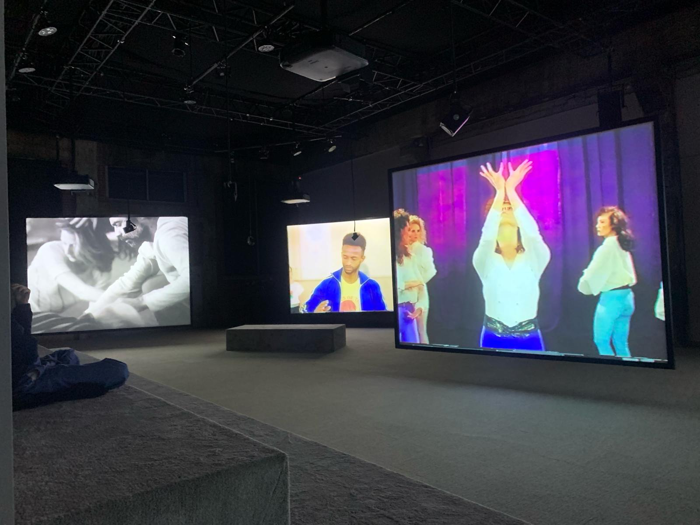
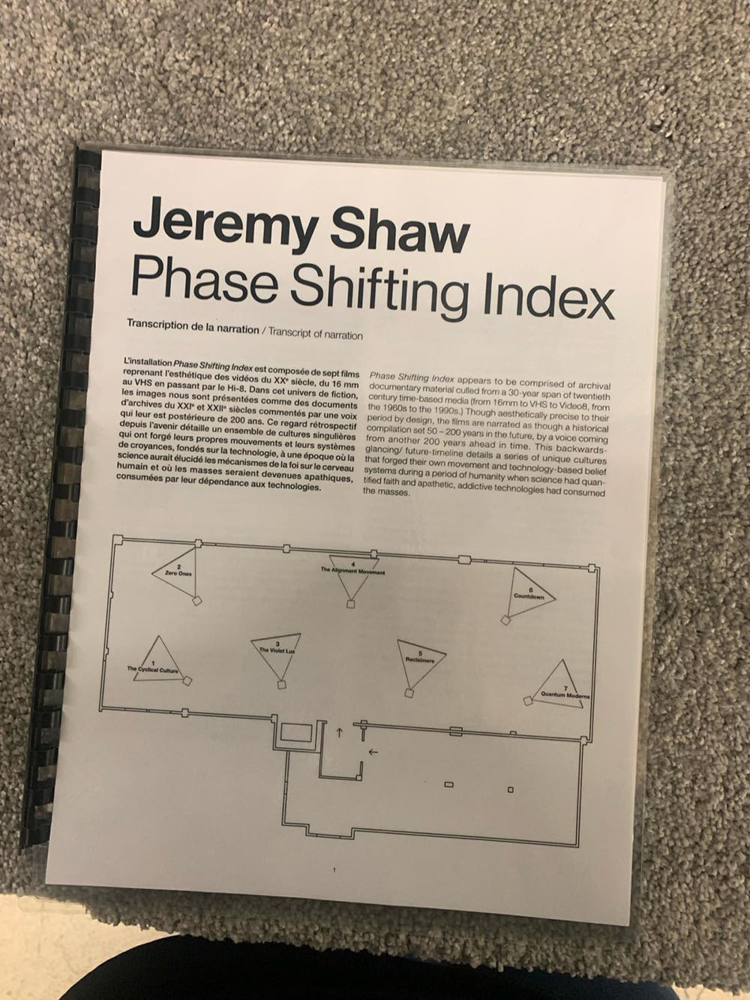
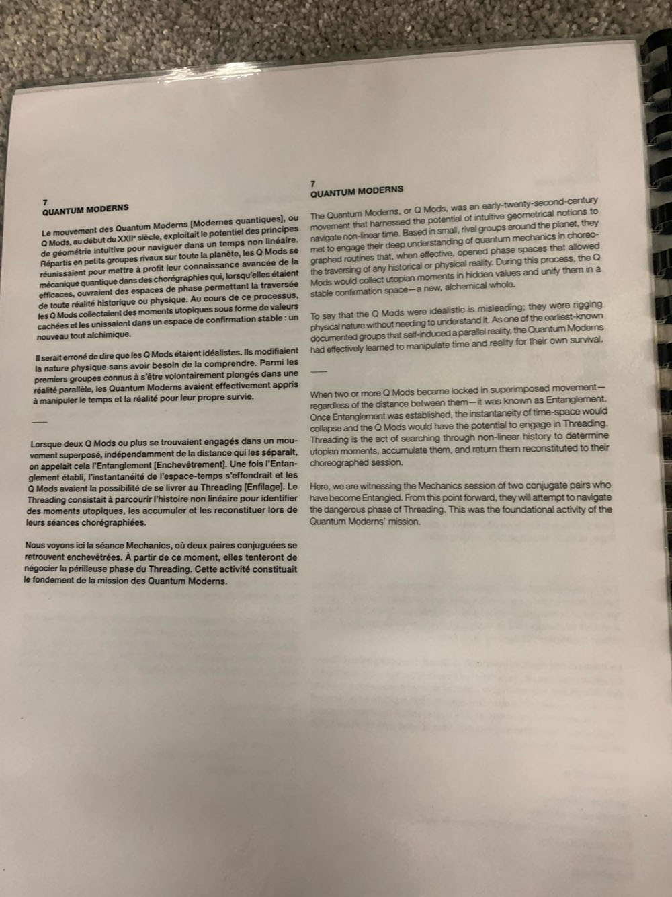
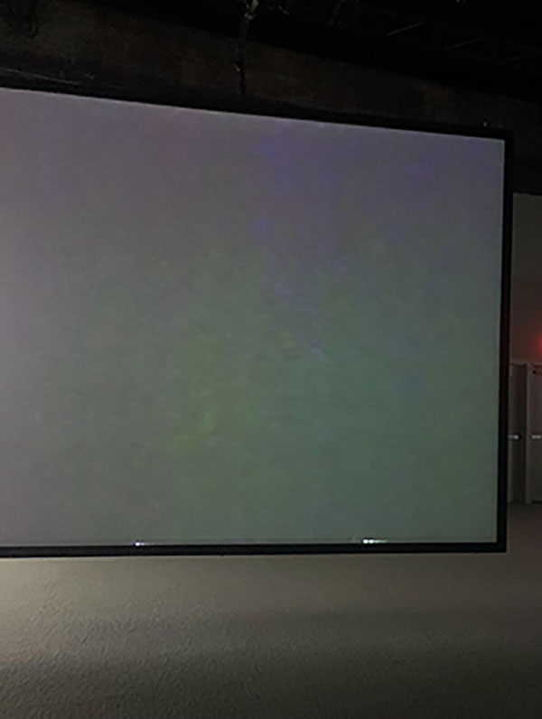

# Jeremy Shaw: Phase Shifting Index

## **Informations sur l'exposition:**

Le titre de l'oeuvre est Phase Shifting Index de l'artiste Jeremy Shaw et la Fonderie Darling a l'accueilli. C'était de type d'exposition intérieure et il était présenté par le Mac. Aussi, l'année de réalisation est en 2004.

  
 

Notre classe l'a visité le matin de 31 janvier 2024.

## **Description de l'oeuvre:**

Dans ce place, il y avait Sept écrans qui a montré des vidéos personnes inconscientes exécutant d'étranges danses et ces vidéos étaient présentés dans une grande salle et son type d'installation était immersive.

   
   
 

## **Composantes et techniques:**

Il y avait des technologies modernes en termes d'écrans, de sons et de musique, mais les clips vidéo étaient un peu vieux.

    
 

## **Éléments nécessaires:**

Il y avait des éléments nécessaires à la mise en exposition et entre ces dernier: Sept écrans , la grande salle et les Haut-parleurs.

 

## **Expérience vécue:**

C'était une bonne visite, mais étrange à la meme temps. Lorsque nous sommes entrés dans une grande salle, j'ai vu sept grands écrans montrant des gens pratiquant des danses étranges et incompréhensibles. Puis les écrans ont commencé à montrer tous les gens faisant les mêmes mouvements, puis des couleurs. est apparu mêlé à une musique forte.

https://github.com/Nourhatwik/H24_V11_inspirations-HATWIK/assets/142917957/463f6ed9-ffc6-48b4-85ae-0ed0efbd3bf9

https://github.com/Nourhatwik/H24_V11_inspirations-HATWIK/assets/142917957/e9e1725c-5215-4f7b-ab12-d16534d2125f

https://github.com/Nourhatwik/H24_V11_inspirations-HATWIK/assets/142917957/e12703aa-387e-4292-9a29-44ccaf288780

Ce qui m'a plu est que j'ai aimé les couleurs des écrans, et même si les vidéos étaient anciennes, elles étaient claires et j'ai aimé le type de musique joué, qui était relaxant.	

 

Mais il y avait des aspect que je ne souhaite pas retenir pour mes propres créations ou que me feriez autrement, comme à la fin des vidéos, une musique forte était diffusée d'une manière qui dérangeait un peu les oreilles, et le type de vidéos était déroutant en termes de sens et peu intelligible.

 
